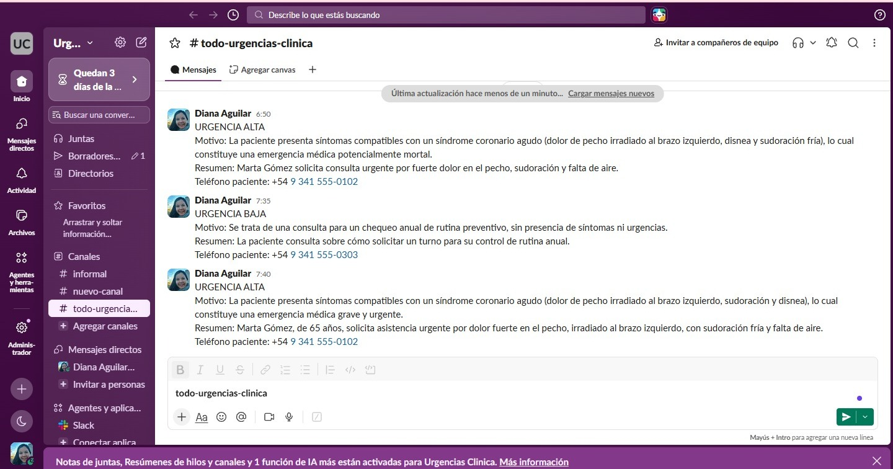
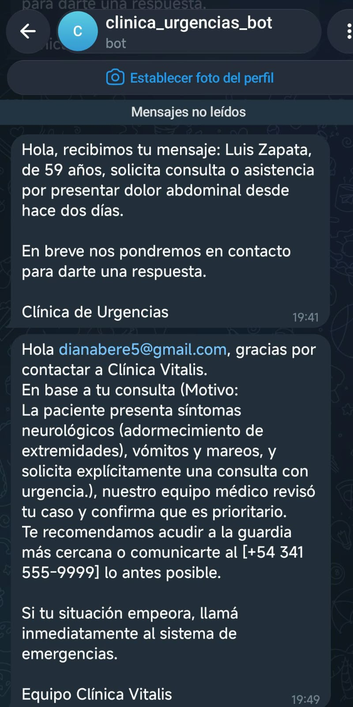
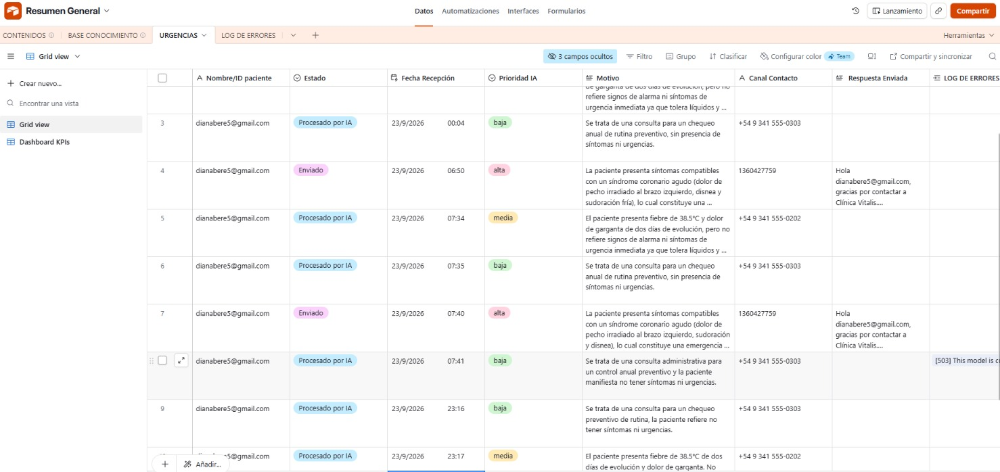
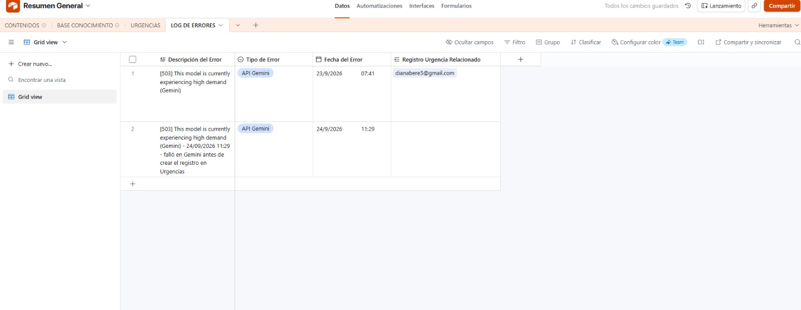
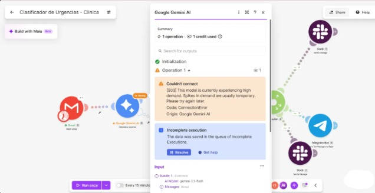
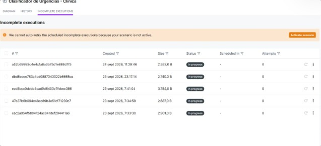
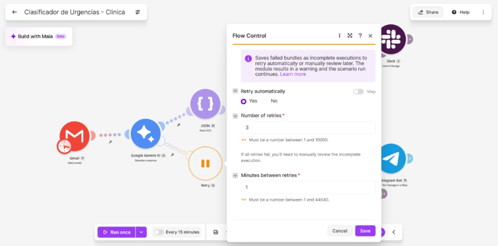
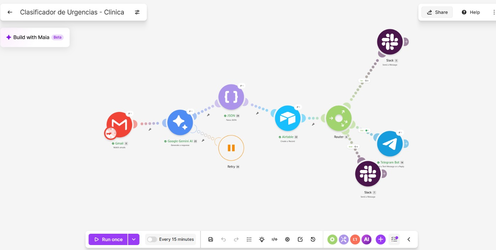
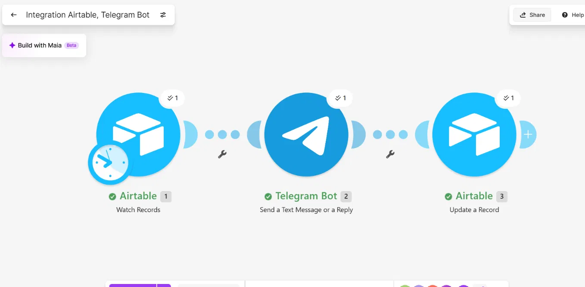
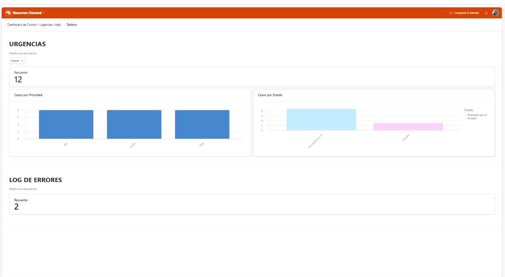

# vitalis-urgencias-entrega-final
Ecosistema de automatización IA para triage de urgencias - Clínica Vitalis - Entrega Final.

## Evidencias de funcionamiento

### 1. Notificaciones en Slack (Alta y Baja)

### 2. Telegram — mensaje automático y aprobación humana

### 3. Airtable — tabla Urgencias

### 4. Airtable — Log de Errores

### 5. Manejo de errores — 503 de Gemini con Retry

### 6. Make — Escenario A (Camino Feliz)

### 7. Make — Escenario B (Aprobación Humana)

### 8. Dashboard de Control (Airtable Interfaces)

